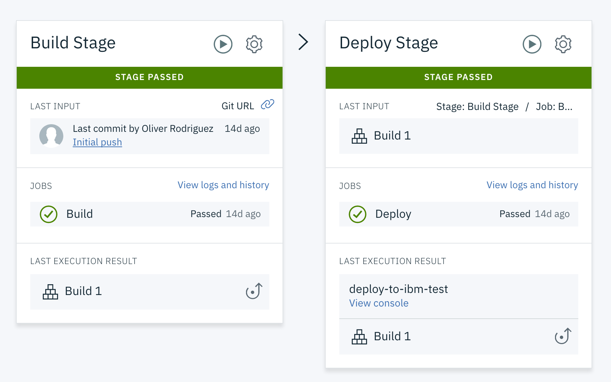
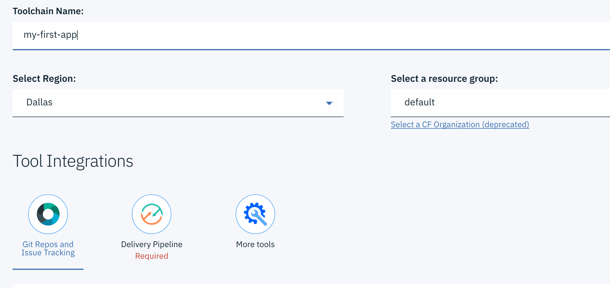
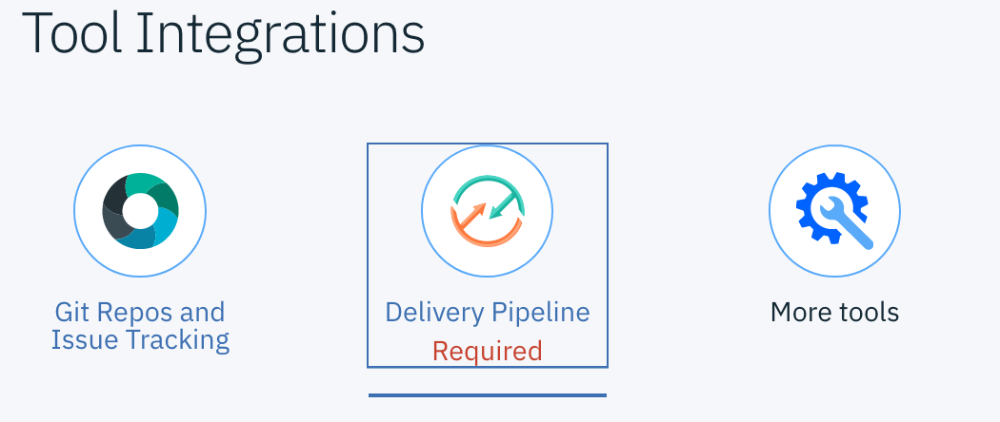
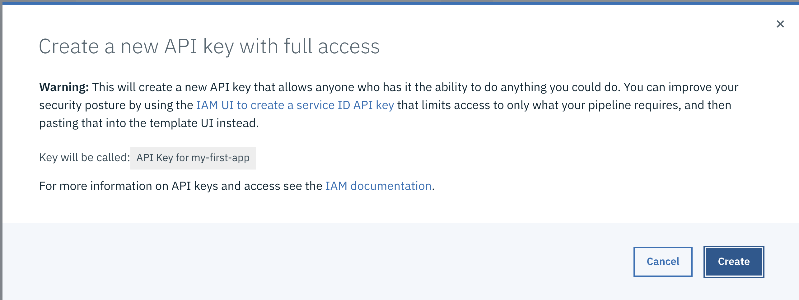
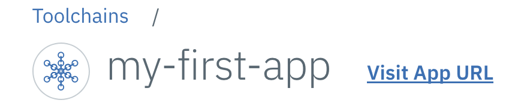

In this Digital Developer Conference challenge, you'll learn how to deploy your first Cloud Foundry application to IBM Cloud using an automated deployment through an IBM Cloud DevOps Toolchain. The toolchain will then build and deploy your application to IBM Cloud when you click a **Deploy to IBM Cloud** button in a later step.

The toolchain that will be created for you looks like this:

This toolchain has four components:

1. Issue management through a hosted GitLab instance on IBM Cloud.
2. A git repo hosted on IBM Cloud.
3. The Eclipse Orion web IDE.
4. A delivery pipeline to build and deploy your application to IBM Cloud.

The pipeline that will build and deploy your application looks like this:

This pipeline has the following two steps:

1. Build: Your application code will be pulled from your repo and the dependencies will be built.
2. Deploy: Your application's build artifacts will then be deployed to IBM Cloud.

## Prerequisites

You must register for an IBM Cloud account before you can complete this challenge.

## Estimated time

This challenge should take you approximately 10 minutes to complete.

## Steps

1. Click the **Deploy to IBM Cloud** image below:

   
   
2. You will be prompted to sign into IBM Cloud. Enter your account information if you have not already signed in.
3. The toolchain creation page opens. Enter a new name for your toolchain. Make a note of the region that displays under **Select Region** -- you will need to use this region name in a later section. The region might not be *Dallas* as shown in the image below because the toolchain attempts to select the region closest to you.

   

4. Click on **Delivery Pipeline** in the Tool Integrations section. You will need to update your pipeline configuration settings.

   

5. Click the **Create** button next to **IBM Cloud API Key** field. A pop-up window opens.

   

6. The window asks if you want to create a new API key for this pipeline. Click **Create**.

   

7. You will see information such as **Region**, **Space**, and **Organization** displayed. If no organization or space displays, make that the **Region** field matches the region from step 3. 
8. Click **Create** at the top right of the page. Your new toolchain is displayed.
9. You can click on the pipeline to view your application being built or you can remain on the toolchain page until the pipeline finishes building.
10. From the toolchain page, you can go directly to your application by clicking **Visit App URL** next to the name of your toolchain.

     **Note**: Due to Internet Explorer and Microsoft Edge limitations, the application will not display in those browsers. We recommended that you open your application using Firefox, Chrome, or Safari instead.

   

If you have completed all the steps correctly, you will see the following image displayed on the home page of your new application:

## Summary
In this challenge, you deployed your first application using IBM Cloud DevOps Toolchains, which enabled you to automatically build and push the application to IBM Cloud. Be sure to explore your newly deployed app, and remember to complete the other challenges.
